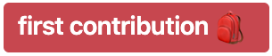

# Nice labels
Nice communication labels for projects.

## :thinking: Why?
A clean communication between people is in the basis of a successful project - even more when you have people from different countries working together.

Accents, words and expressions can be easily misunderstood or used in the wrong time. So, creating a pattern is always a better approach to prevent this kind of unconvenience.

## :thinking: How?
Here I'm leaving some ideas of labels to tag your PRs, issues and other kind of communications when creating/developing a project.

They can be used in your repos (GitHub, GitLab...), kanban boards (JIRA, Trello, Asana...) and whatever tool you want to. 

### GitHub
Every repo comes with the [default labels](https://help.github.com/en/github/managing-your-work-on-github/about-labels#using-default-labels). To keep easy, you can create a [template repo](https://help.github.com/en/github/creating-cloning-and-archiving-repositories/creating-a-template-repository) with your customized labels and create new repos from the template. It's very useful for PR/issues templates too!

### GitLab
After creating a project, you can create [a default set of labels](https://docs.gitlab.com/ee/user/project/labels.html#creating-labels) as a start.

## :alien: Visual
Emojis and colors can be used as visual helpers for better understanding of the subject.
Personally, I like emojis very much and quite often use them while writing docs, PR descriptions, issues, drafts and labels...

If you want to use them, nice! But, try to keep them after the name (specially for labels), like: `documentation :page_facing_up:`. When emojis are before the name, some sorting issues can be faced.

Colors are very welcome too, and can be used with color psychology to help others understand the context. But beware, because not all people see them the same way you do. Try to avoid background/content merging, like it:

## :name_badge: Labels
Here are some ideas to use:

### Generic
Those labels define the kind of work you are/were doing:

#### General development (features, refactors, bumps...)
- `feature`
- `experiment`
- `quality`
- `security`
- `enhancement`
- `improvement`
- `refactor`
- `automation`
- `hotfix`
- `bugfix`
- `a11y`
- `performance`
- `code removal`

#### Docs (documentation, examples...)
- `docs`
- `examples`
- `good first issue`
- `dependencies`
- `bump`
- `onboarding`

#### Problems
- `bug`
- `critical`
- `help wanted`
- `invalid`
- `duplicate`
- `need test`
- `need example`

#### Status
- `hold`
- `waiting for tests`
- `wip`
- `backlog`
- `idea`
- `proposal`
- `deliverable`
- `discussion`
- `suggestion`
- `support`
- `first contribution`

### Specific
Depending on your review policy, specific labels can be used too. Good examples of it can be:

#### Areas
- `frontend`
- `backend`
- `cloud`

#### Stacks or platforms
- `javascript`
- `ruby`
- `kubernetes`

#### Teams or Scopes
- `product`
- `marketing`

#### Teams or Status
- `CI:wait`
- `devops:review`

---
Feel free to use, modify and share! :boom:

Licensed under the [GNU 3.0](https://github.com/jlozovei/nice-labels/blob/master/LICENSE).